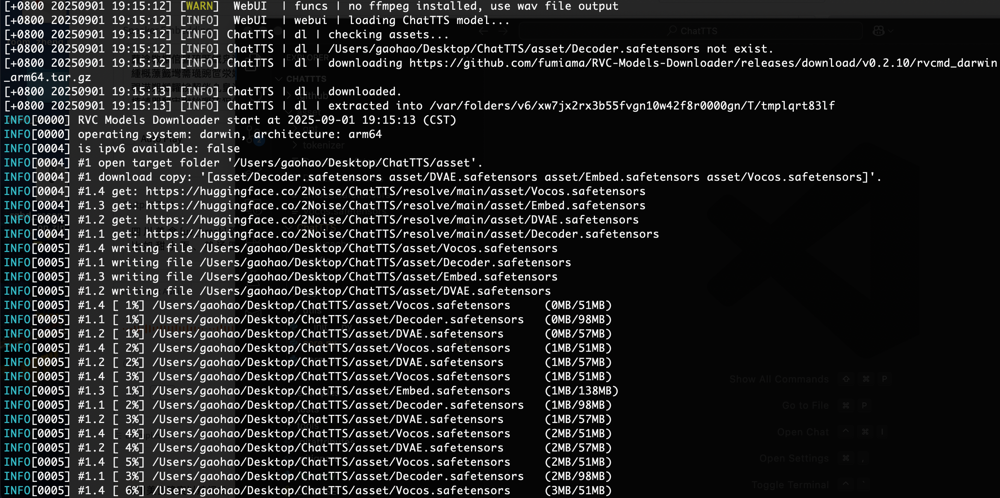

# Chat With Me

这个项目实现了将大语言模型生成的文本使用 TTS 转换为音频并进行播放，提供了终端交互与 WebUI 交互的两种形式。项目仍然优化过程中，更多功能将陆续推出。

----
# Step1. 安装 ChatTTS

将 [ChatTTS](https://github.com/2noise/ChatTTS) 作为一个独立的库进行安装，因为拉取模型时需要适配你的平台。

```bash
$ git clone https://github.com/2noise/ChatTTS.git
```

创建 conda 环境：

```bash
$ cd ChatTTS
$ conda create -n chattts python=3.11
$ conda activate chattts
$ pip install -r requirements.txt
```

国内用户为了正确拉取模型还需要安装以下依赖：

```bash
$ pip install modelscope
$ pip install transformers==4.53.2
$ pip install soundfile
```

找到项目中 `ChatTTS/core.py` 文件并修改 2 处位置：

* 位置一：大约在第 14 行:
```python
# from huggingface_hub import snapshot_download
from modelscope import snapshot_download
```

* 位置二：大约在第 113 行:

```python
# download_path = snapshot_download(
#     repo_id="2Noise/ChatTTS",
#     allow_patterns=["*.yaml", "*.json", "*.safetensors"],
#     cache_dir=custom_path,
#     force_download=force_redownload,
# )
download_path = snapshot_download(
	repo_id="pzc163/ChatTTS",
	allow_patterns=["*.yaml", "*.json", "*.safetensors"],
	cache_dir=custom_path,
	force_download=force_redownload,
)
```

在修改完成后建议运行示例以自动拉取模型文件：

```bash
$ python examples/web/webui.py
```



----
# Step2. 拉取源码

```bash
$ git clone https://github.com/GaohaoZhou-ops/Chat-With-Me.git
```

安装依赖：

```bash
$ conda activate chattts
$ pip install -r requirements.txt
```

----
# Step3. 修改配置文件

项目的所有配置都在 `config.yaml` 文件中，在这个文件中你可以修改本地/在线模型名、系统提示词、声纹文件等信息。

```yaml
use_online_model: true  # 是否使用在线模型

online_model:       # 在线模型配置
  name: "deepseek-chat"
  api_key: "Your API Key"
  base_url: "https://api.deepseek.com"

local_model:        # 本地模型配置
  name: "qwen3:14b" # 本地Ollama模型

chat_tts_path: "/Users/gaohao/Desktop/ChatTTS" # 修改为你的 ChatTTS 项目目录

speaker_embedding_path: "./asset/speaker_embedding.pkl" # 默认加载的音色，如果不存在则每次运行后随机生成

# 模型系统提示词
system_prompt: |
  你是一个乐于助人的人工智能助手。你的回答必须总是简洁、清晰，并尽可能提供帮助。
  你的回答必须严格遵守以下规范：
  1. 回答中不允许有任何表情、代码、json、markdown等非语音格式的内容。
  2. 【最重要规则】回答中的所有阿拉伯数字（0-9）都必须转换为中文汉字。这是一个强制性要求。
     - 例如：'2024年' 必须转换为 '二零二四年'。
     - 例如：'100个人' 必须转换为 '一百个人'。
     - 例如：'8.5分' 必须转换为 '八点五分'。
     - 你的回答中绝对不允许出现任何形式的阿拉伯数字。
```

----
# Step4. 运行

项目提供了终端交互和WebUI交互两种形式，使用不同的命令即可运行：

* CLI:
```bash
(chattts) $ python start_cli.py
```

* WebUI

启动后通过浏览器前往 `http://127.0.0.1:7860/` 即可访问：
```bash
(chattts) $ python start_webui.py
```

