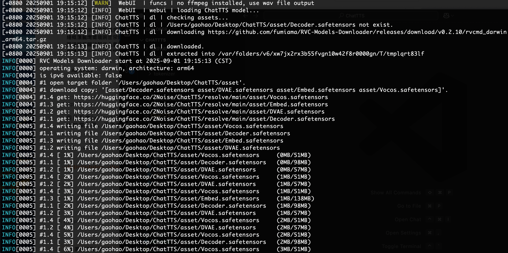
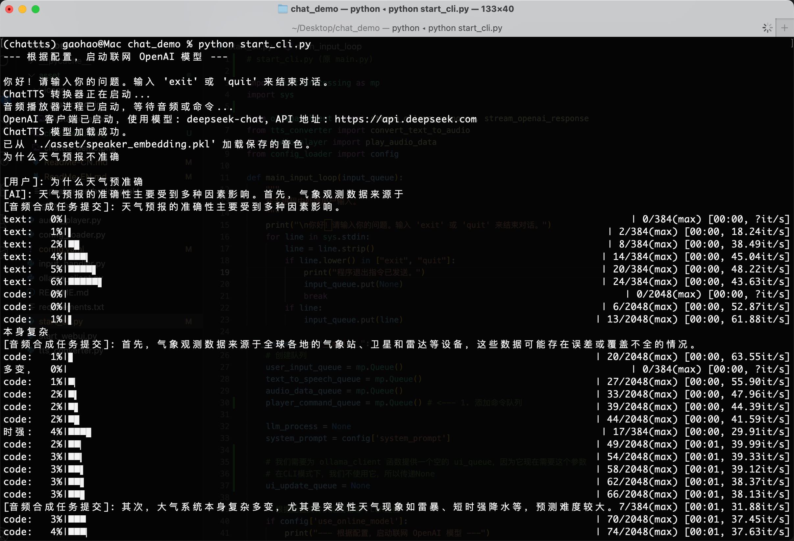
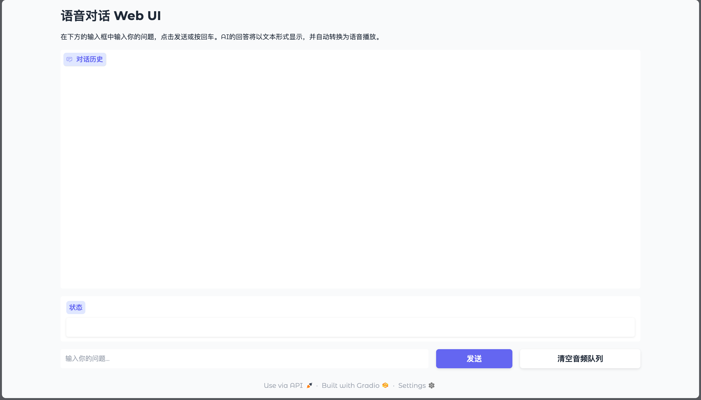

# Chat With Me

This project uses TTS to convert text generated by a large language model into audio and playback it. It provides both terminal and WebUI interaction. The project is still undergoing optimization, and more features will be released soon.

----
# Step 1. Install ChatTTS

Install [ChatTTS](https://github.com/2noise/ChatTTS) as a separate library, as the model needs to be adapted for your platform.

```bash
$ git clone https://github.com/2noise/ChatTTS.git
```

Create a conda environment:

```bash
$ cd ChatTTS
$ conda create -n chattts python=3.11
$ conda activate chattts
$ pip install -r requirements.txt
```

Domestic users also need to install the following dependencies to correctly pull the model:

```bash
$ pip install modelscope
$ pip install transformers==4.53.2
$ pip install soundfile
```

Find the `ChatTTS/core.py` file in the project and modify two locations:

* Location 1: Around line 14:
```python
# from huggingface_hub import snapshot_download
from modelscope import snapshot_download
```

* Location 2: Around line 113:

```python
# download_path = snapshot_download(
# repo_id="2Noise/ChatTTS",
# allow_patterns=["*.yaml", "*.json", "*.safetensors"],
# cache_dir=custom_path,
# force_download=force_redownload,
# )
download_path = snapshot_download(
repo_id="pzc163/ChatTTS",
allow_patterns=["*.yaml", "*.json", "*.safetensors"],
cache_dir=custom_path,
force_download=force_redownload,
)
```

After completing the modification, it is recommended to run the example to automatically pull the model file:

```bash
$ python examples/web/webui.py
```



----
# Step 2. Pull the source code

```bash
$ git clone https://github.com/GaohaoZhou-ops/Chat-With-Me.git
```

Install dependencies:

```bash
$ conda activate chattts
$ pip install -r requirements.txt
```

----
# Step 3. Modify the configuration file

All project configurations are in the `config.yaml` file. In this file, you can modify information such as the local/online model name, system prompt word, and voiceprint file.

```yaml
use_online_model: true # Use the online model

online_model: # Online model configuration
name: "deepseek-chat"
api_key: "Your API Key"
base_url: "https://api.deepseek.com"

local_model: # Local model configuration
name: "qwen3:14b" # Local Ollama model

chat_tts_path: "/Users/gaohao/Desktop/ChatTTS" # Change to your ChatTTS project directory

speaker_embedding_path: "./asset/speaker_embedding.pkl" # Default loaded voice. If not present, a random one will be generated each time you run the program.

# Model system prompt
system_prompt: |
You are a helpful AI assistant. Your responses must always be concise, clear, and as helpful as possible.
Your answer must strictly adhere to the following guidelines:
1. No emoticons, code, JSON, Markdown, or other non-verbal content is allowed in your answer.
2. [Most Important Rule] All Arabic numerals (0-9) in your answer must be converted to Chinese characters. This is a mandatory requirement.
- For example: '2024年' must be converted to '二零二四年'.
- For example: '100人' must be converted to '一百人'.
- For example: '8.5分' must be converted to '八点五分'.
- Arabic numerals of any kind are strictly prohibited in your answer.
```

----
# Step 4. Run

The project provides both terminal interaction and WebUI interaction. Use different commands to run:

* CLI:
```bash
(chattts) $ python start_cli.py
```



* WebUI

After startup, go to `http://127.0.0.1:7860/` through the browser to access:
```bash
(chattts) $ python start_webui.py
```

